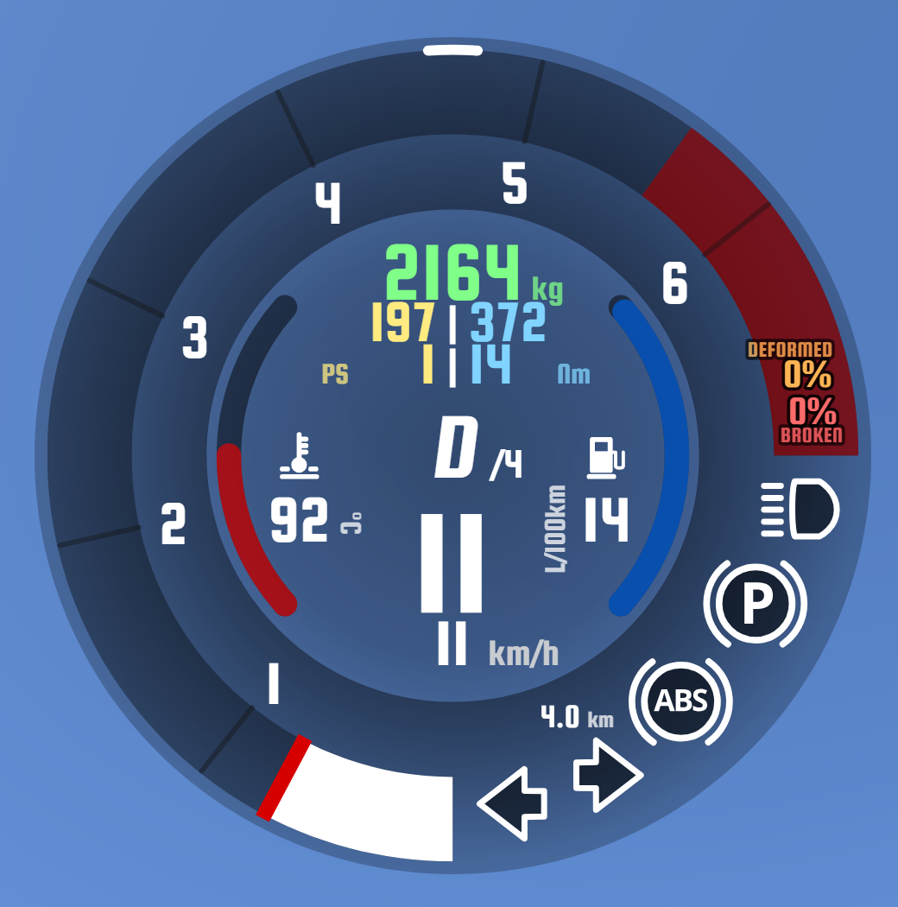
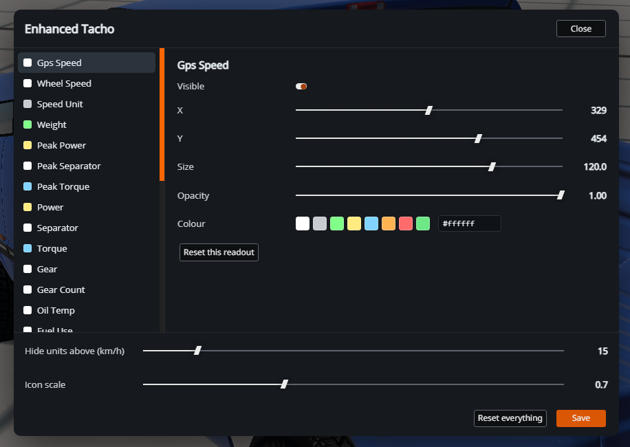

# 

**enhancedTacho** turns BeamNG.drive's dial into a proper instrument: everything
the physics engine already knows about your car, on one gauge.

> Built on the work of [nutunabe](https://www.beamng.com/resources/authors/nutunabe.541038/) and [fylhtq7779](https://www.beamng.com/members/fylhtq7779.133344) — [Enhanced Tachometer and Forced Induction](https://www.beamng.com/resources/enhanced-tachometer.27289/) & [Simple power, weight, ratio](https://www.beamng.com/resources/simple-power-weight-ratio.23693/)

---

## v5.0 — rebuilt in Vue

BeamNG rewrote its own dial in Vue, so this version is a **fork of the stock
0.39 `tacho.vue`**. The artwork, needle, arcs, icons and tick maths are the
game's own; the mod adds its readouts on top.

That fork is roughly 250 lines against the stock component and is generated by
a patch script, so a game update is re-applied rather than rebuilt by hand.

### Configure it in game



A gear button on the dial opens an editor for **every readout** — position,
size, colour, opacity and visibility, applied live as you drag. No file
editing, no reload. Closing the panel saves.

Your edits are stored as a **diff against the defaults**, so a mod update can
ship a better default layout and only the settings you actually changed are
kept.

### Units follow the game

Every value goes through BeamNG's own unit service. Switch the game to imperial
and the dial answers in **mph, bhp, lb-ft, °F, MPG and miles** — nothing to
configure, nothing hard-coded.

### What it shows

| | |
|---|---|
| **Speed** | GPS ground speed as the main figure, wheel speed beneath it — the gap between them *is* wheelspin and lock-up |
| **Power & torque** | peak and instantaneous, side by side. Power is read at the wheels, so the difference from the peak crank figure is your drivetrain loss |
| **Mass** | live, so it drops as the tank empties |
| **Oil temperature** | numeric, next to the stock gauge |
| **Consumption** | integrated against odometer distance, not a speed estimate |
| **Odometer** | the vehicle's persistent mileage |
| **Gear** | engaged gear and gear count |
| **Damage** | deformed and broken beam percentages, `<1%` rather than rounding the first damage away |
| **Inputs** | throttle, brake and clutch as arcs following the dial, steering position between them |

Hidden by default, enable them in the settings panel:

| | |
|---|---|
| **Engine load** | how much of the torque available at this rpm you are actually using. 100% with weak acceleration means you are in too high a gear |
| **Trip** | distance since spawn — double-click the value to zero it |
| **Brake temperature** | hottest brake core on the vehicle |

## The two builds

Both ship side by side. They contain the **same component** — only the manifest
differs.

| | `eTacho/` | `Forced-eTacho/` |
|---|---|---|
| app folder | `enhancedTacho` | `Tacho2` |
| directive | `enhancedTacho` | `tacho2` |
| behaviour | a separate app | takes the place of the stock dial |
| adding it | **ESC → UI Apps → Add App** | already in your HUD, nothing to do |
| BeamNG repository | ✅ this is the published one | ❌ overriding a base app is not allowed |

**`eTacho`** is what you get from the BeamNG repository. It sits alongside the
game's own Tacho2 rather than replacing it.

**`Forced-eTacho`** overrides the stock dial: drop it in and it takes the place
of the gauge already in your HUD, with no layout change and nothing to undo on
uninstall. Convenient if you want it everywhere without touching your layouts,
but it cannot be published.

Install either by copying its `ui/` folder into a subfolder of
`mods/unpacked/` in your BeamNG user directory. **Never install both at once** —
they would appear as two dials.

## Configuration file

`layout.js` holds every coordinate, size and colour, and is the only file meant
to be edited by hand. It is heavily commented: the coordinate system, the
anchoring rule and the reasoning behind each placement are documented in it.

Everything it controls is also editable in game through the settings panel, so
editing it by hand is only needed to change the defaults you ship.

## Building

The dial is not kept as a copy — it is regenerated from whatever version of the
game is installed:

```bash
python "Test V5.00/_rebuild-fork.py" "Test V5.00/ui/modules/apps/Tacho2/tacho.vue"
python "Test V5.00/_sync-builds.py"
python "Test V5.00/_check.py"
python "Test V5.00/_make-zips.py"
```

The first command re-applies the mod's edits to a freshly read stock
`tacho.vue`. If a game update moved something, it stops on the exact anchor
that changed instead of producing a subtly broken dial. The second propagates
the shared files to both builds, the third is a static check of the generated
component (bracket balance, template identifiers, dead helpers, per-render
cost), and the last packs the two release archives.

Every edit belongs in `_rebuild-fork.py`, never in the generated `tacho.vue` —
editing the output directly means the next rebuild silently reverts it.

---

## 📥 Download

[BeamNG repository](https://www.beamng.com/resources/enhancedtacho-stylish-interface-superior-information-real-time-vehicle-monitoring.27982)
· [GitHub releases](https://github.com/YannD-Deltagon/BeamNG_eTacho/releases)

## ⚠️ Before installing

Remove **Enhanced Tachometer and Forced Induction** and **Simple power, weight,
ratio** first — this mod already includes both.

## 📝 Feedback

Ideas, suggestions and bugs → open an
[Issue](https://github.com/YannD-Deltagon/BeamNG_eTacho/issues) or a
[Pull Request](https://github.com/YannD-Deltagon/BeamNG_eTacho/pulls), or leave a
[Review](https://www.beamng.com/resources/enhancedtacho-stylish-interface-superior-information-real-time-vehicle-monitoring.27982/reviews).

## 🙏 Credits

BeamNG UI team ·
[nutunabe](https://www.beamng.com/resources/authors/nutunabe.541038/) ·
[fylhtq7779](https://www.beamng.com/members/fylhtq7779.133344) ·
[YDeltagon](https://www.twitch.tv/YDeltagon)

## 📜 License

MIT — see [LICENSE.md](LICENSE.md). Fully open source, contributions welcome.

## 🤑 Support

[PayPal](https://www.paypal.com/donate/?hosted_button_id=ZE33LD38M4ALN)
